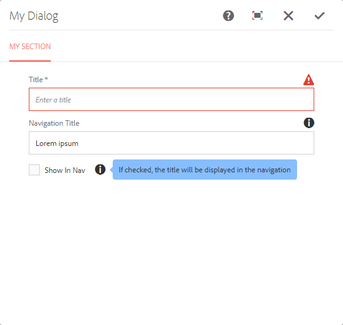

# AEM Filebuilder

### Introduction
This library helps build dialogs for AEM by providing a DSL to build a dialog model that can be compiled into XML 
during your project's compilation. Currently Maven is supported due to being the standard for AEM projects, but a 
Javascript-based version may come in the future for those who pre-process their AEM code with Node.js or similar.


#### Why?

XML is great for configuration, but it's difficult for developers to quickly read and write. This project is intended 
to solve that by introducing a natural DSL which is easy to read and write. It also brings several other benefits:

* Refer to your AEM bundle's constants directly in the Dialog DSL - ensure your dialog and Java classes are always 
  dealing with the same property name
* Share snippets of dialog code between different components
* Provides a simple, extensible API so you can develop your own DSL functions and types.
* Interoperable - use side by side with standard XML files

The library will also allow you to force code quality standards. For example, you could create your own text field DSL 
function called `myTextField()` that requires  a field label which is between 4 and 25 characters and a non-empty 
field description in order for the build to succeed.


### Quick Example
Example of a simple _cq_dialog.xml file written in Kotlin:

**apps/project/components/example/_cq_dialog.xml.kts**
```kotlin
import io.redcastle.aem.filebuilder.dsl.checkbox
import io.redcastle.aem.filebuilder.dsl.dialog
import io.redcastle.aem.filebuilder.dsl.section
import io.redcastle.aem.filebuilder.dsl.textField
import io.redcastle.aem.filebuilder.model.dialog.field.Checkbox

dialog("My Dialog") {
    section("section1") {

        title = "My Section"

        textField("title", "./jcr:title") {
            fieldLabel = "Title"
            maxlength = 100
            emptyText = "Enter a title"
            required = true
        }

        textField("navTitle", "./navTitle") {
            fieldLabel = "Navigation Title"
            fieldDescription = "The title to be used in the the global nav when referring to this content"
            maxlength = 30
        }

        checkbox("showInNav", "./showInNav") {
            text = "Show In Nav"
            value = "{Boolean}true"
            fieldDescription = "If checked, the title will be displayed in the navigation"
            toolTipPosition = Checkbox.TooltipPosition.RIGHT
        }
    }
}

```

The above code creates the following output after `mvn clean install` runs:

**apps/project/components/example/_cq_dialog.xml**
```xml
<?xml version="1.0" encoding="UTF-8" standalone="no"?>
<jcr:root xmlns:jcr="http://www.jcp.org/jcr/1.0" xmlns:cq="http://www.day.com/jcr/cq/1.0"
          xmlns:nt="http://www.jcp.org/jcr/nt/1.0" xmlns:sling="http://sling.apache.org/jcr/sling/1.0"
          jcr:primaryType="nt:unstructured" jcr:title="My Dialog"
          sling:resourceType="cq/gui/components/authoring/dialog">
    <content jcr:primaryType="nt:unstructured" 
             sling:resourceType="granite/ui/components/foundation/container">
        <layout jcr:primaryType="nt:unstructured" 
                sling:resourceType="granite/ui/components/foundation/layouts/tabs"
                type="nav"/>
        <items jcr:primaryType="nt:unstructured">
            <section1 jcr:primaryType="nt:unstructured" 
                      jcr:title="My Section"
                      sling:resourceType="granite/ui/components/foundation/section">
                <items jcr:primaryType="nt:unstructured">
                    <column jcr:primaryType="nt:unstructured"
                            sling:resourceType="granite/ui/components/foundation/container">
                        <items jcr:primaryType="nt:unstructured">
                            <title emptyText="Enter a title" 
                                   fieldLabel="Title" 
                                   jcr:primaryType="nt:unstructured"
                                   maxlength="100" 
                                   name="./jcr:title" 
                                   required="true"
                                   sling:resourceType="granite/ui/components/coral/foundation/form/textfield"/>
                            <navTitle
                                    fieldDescription="The title to be used in the the global nav when referring to this content"
                                    fieldLabel="Navigation Title" 
                                    jcr:primaryType="nt:unstructured" 
                                    maxlength="30"
                                    name="./navTitle"
                                    sling:resourceType="granite/ui/components/coral/foundation/form/textfield"/>
                            <showInNav fieldDescription="If checked, the title will be displayed in the navigation"
                                       jcr:primaryType="nt:unstructured" 
                                       name="./showInNav"
                                       sling:resourceType="granite/ui/components/coral/foundation/form/checkbox"
                                       text="Show In Nav" 
                                       toolTipPosition="right" 
                                       value="{Boolean}true"/>
                        </items>
                    </column>
                </items>
                <layout jcr:primaryType="nt:unstructured"
                        sling:resourceType="granite/ui/components/foundation/layouts/fixedcolumns"/>
            </section1>
        </items>
    </content>
</jcr:root>
```

This makes a dialog such as the following:



More samples can be found [here](samples/ui.apps/src/main/content/jcr_root/apps/aem-filebuilder/components).

### Artifacts

This repository is not on Maven Central or Bintray yet - it will be added when the project is less experimental.

### Dependencies

This project depends on the `filegen-maven-plugin` to convert the files to the typical XML format for AEM.

### Project Status

Everything is currently experimental, still in development and subject to change as part of the 0.x.x releases. 
These versions should not be considered production ready, as the API and implementation may change at any time 
prior to the 1.0.0 release.
